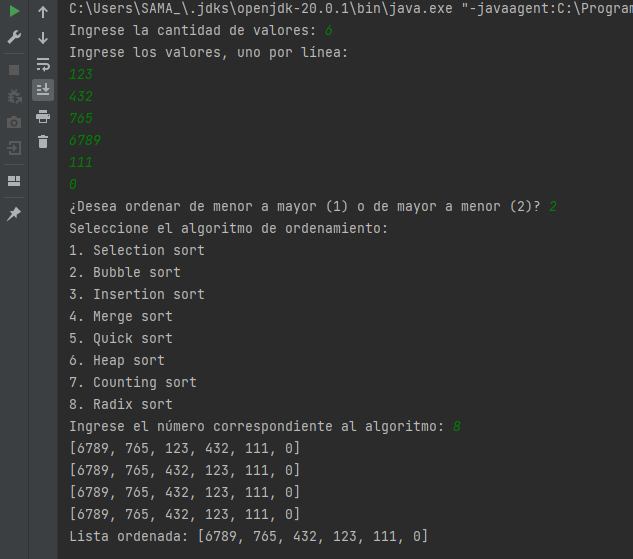

# Algoritmos de Ordenamiento

Este proyecto en Java implementa varios algoritmos de ordenamiento utilizando programación orientada a objetos (POO). Los algoritmos de ordenamiento disponibles son:

1. Selection Sort
2. Bubble Sort
3. Insertion Sort
4. Merge Sort
5. Quick Sort
6. Heap Sort
7. Counting Sort
8. Radix Sort

## Requisitos

- Java Development Kit (JDK) 20 o superior instalado en tu sistema.
- Un entorno de desarrollo integrado (IDE) como Eclipse, IntelliJ IDEA o NetBeans (opcional).

## Cómo utilizar y compilar el programa

1. Descarga o clona el proyecto en tu máquina local.
2. Abre el proyecto en tu IDE preferido o simplemente accede a la carpeta del proyecto.
3. Busca el archivo `OrdenamientoMain.java` y ábrelo.
4. En el IDE, ejecuta el archivo `OrdenamientoMain.java` o compílalo y ejecuta el archivo generado.

## Uso del programa

1. El programa solicitará al usuario la cantidad de valores que desea ordenar.
2. A continuación, el usuario debe ingresar los valores, uno por línea, siguiendo las instrucciones del programa.
3. Luego, el programa preguntará al usuario si desea ordenar los valores de forma ascendente (de menor a mayor) o descendente (de mayor a menor).
4. Después, el programa mostrará una lista de algoritmos de ordenamiento disponibles y pedirá al usuario que seleccione uno ingresando el número correspondiente.
5. Finalmente, el programa mostrará paso a paso cómo se va ordenando la lista y, al finalizar, mostrará la lista ordenada.

**Nota:** Si el usuario no selecciona un algoritmo válido, el programa utilizará el Bubble Sort por defecto.

## Descripción de los algoritmos

A continuación, se proporciona una breve descripción de cada algoritmo de ordenamiento incluido en este programa:

### 1. Selection Sort

El Selection Sort es un algoritmo simple que busca repetidamente el elemento mínimo (o máximo) desde la parte no ordenada de la lista y lo coloca al principio. Se repite este proceso hasta que la lista esté completamente ordenada.

### 2. Bubble Sort

El Bubble Sort es un algoritmo que compara repetidamente elementos adyacentes y los intercambia si están en el orden incorrecto. Esto hace que los elementos más grandes "floten" hacia el final de la lista y los más pequeños se "hundan" hacia el principio. Se repite este proceso hasta que la lista esté completamente ordenada.

### 3. Insertion Sort

El Insertion Sort es un algoritmo que construye una lista ordenada a medida que se recorre la lista no ordenada. En cada iteración, se toma un elemento de la lista no ordenada y se inserta en la posición correcta en la lista ordenada. Se repite este proceso hasta que la lista esté completamente ordenada.

### 4. Merge Sort

El Merge Sort es un algoritmo de divide y vencerás que divide la lista en mitades más pequeñas, las ordena por separado y luego las combina para obtener una lista ordenada. Se repite este proceso hasta que la lista esté completamente ordenada.

### 5. Quick Sort

El Quick Sort es otro algoritmo de divide y vencerás que elige un elemento como "pivote" y divide la lista en dos partes, una con elementos menores que el pivote y otra con elementos mayores. Luego, se aplica recursivamente el mismo proceso a las dos partes y se combina para obtener una lista ordenada.

### 6. Heap Sort

El Heap Sort utiliza una estructura de datos llamada "heap" para ordenar la lista. En cada iteración, el algoritmo extrae el elemento máximo (o mínimo) del heap y lo coloca al final de la lista ordenada. Luego, se ajusta la estructura del heap y se repite este proceso hasta que la lista esté completamente ordenada.

### 7. Counting Sort

El Counting Sort es un algoritmo de ordenamiento especializado que funciona bien cuando los valores de la lista están en un rango limitado. Cuenta el número de ocurrencias de cada valor y utiliza esta información para reconstruir la lista ordenada.

### 8. Radix Sort

El Radix Sort es un algoritmo de ordenamiento no comparativo que utiliza el ordenamiento estable basado en dígitos. Ordena los elementos procesándolos por dígitos individuales, comenzando desde el dígito menos significativo hasta el más significativo. Esto se repite hasta que todos los dígitos hayan sido considerados y la lista esté completamente ordenada.

Espero que esta información te ayude a comprender los algoritmos de ordenamiento implementados en este programa. Si tienes alguna pregunta adicional, no dudes en preguntar.
